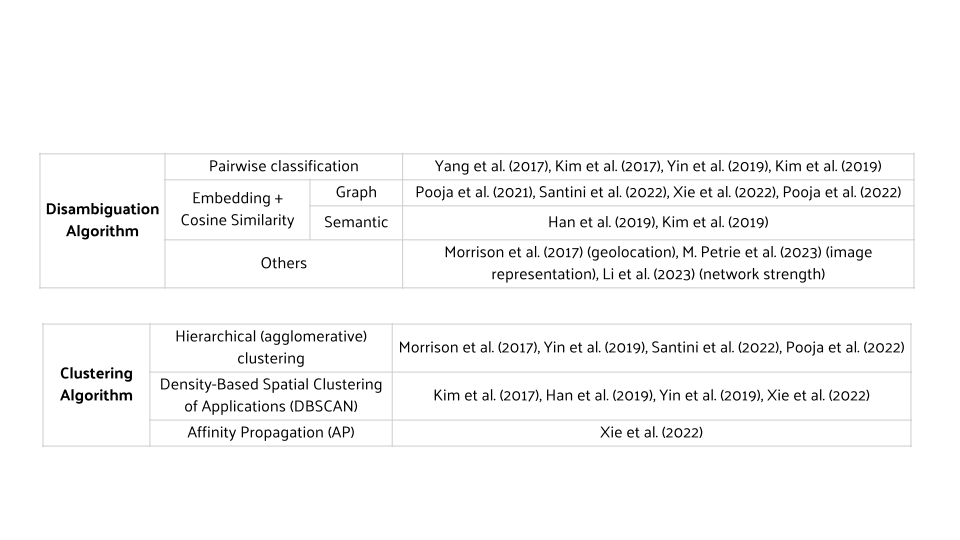

# Disambiguation of the World's Inventors

Serial inventors often patent under different names, firms, places, and time periods. Identifying the correct individuals is challenging process and remains to be done for the world’s inventors contained in PATSTAT. The goal of this project is to address the ambiguity issue of inventors in the PATSTAT.

## 🟠 Previous Approaches:

## 🟣 Our Solution: Siamese Network

Previous studies propose various strategies for inventor disambiguation, but many rely heavily on pairwise comparisons, which are computationally intensive. To address this, we introduce a deep learning framework based on Siamese Networks. It represents each patent as a vector in a high-dimensional space. Using triplet or contrastive loss, patents by the same individuals are grouped closely, while those by different inventors are visually separated. This approach departs from the pairwise comparison paradigm, leading to advancements in computational efficiency.

## 🔵 Procedure Flowchart:

## 🟤 Disambiguation Samples (PATSTAT):

## ⚪️ Furture Work: Clustering!

Inventors in some blocks are still hard to disambiguate even under the pre-trained Siamese Networks model. Thus, in future work, considering a clustering model as a further step can be helpful to finish disambiguating of PATSTAT

